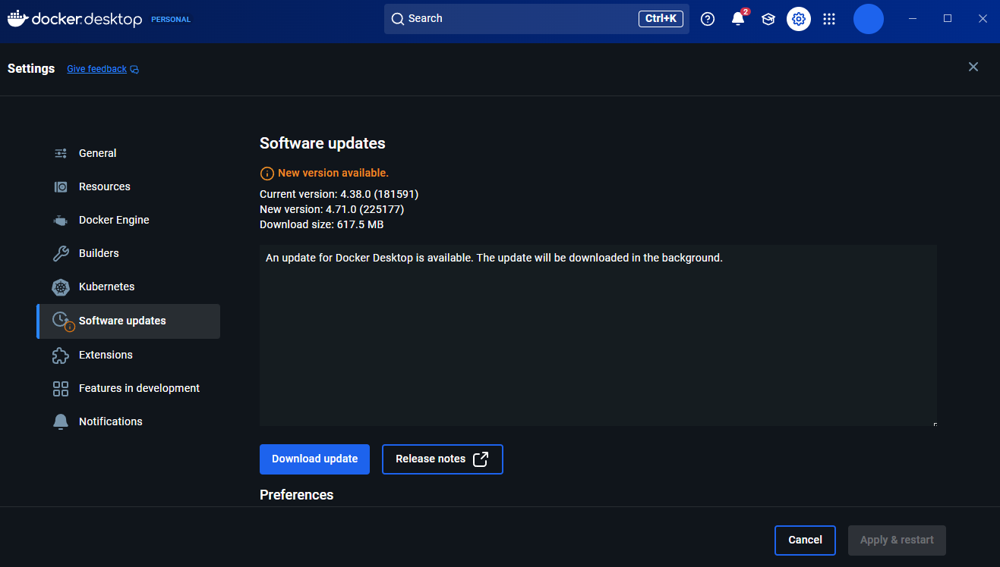
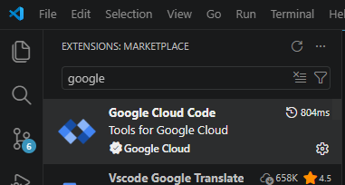
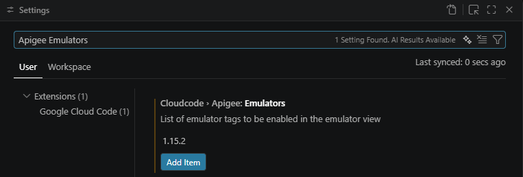
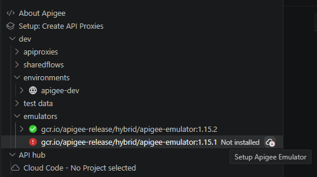
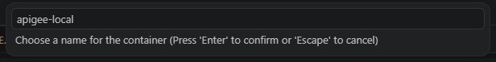
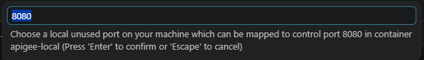
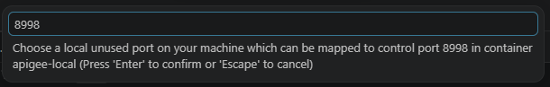
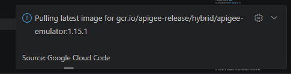

# Apigee Emulator


Este repositorio contiene una detalla solución técnica para implementar un entorno de desarrollo local de Apigee utilizando **Cloud Code** en VS Code, resolviendo específicamente los conflictos de comunicación con Docker y la gestión de recursos locales.

## Diagnóstico del Error Principal
Al utilizar versiones recientes de Docker Desktop (v29.0.0+), la extensión de Google Cloud Code falla al intentar detectar el contenedor, lanzando el error: 

`Error: Could not find the newly created container apigee-dev`

Esto se debe a un cambio en el esquema del JSON de respuesta del motor de Docker (cambio de `ApiVersion` a `APIVersion`).

## Instalación

### 1. Downgrade de Docker Desktop
Es obligatorio retroceder a una versión que utilice el **Docker Engine v27.x** para mantener la compatibilidad con el plugin actual de Google.

* **URL de descarga oficial:** [Docker Desktop Installer v4.38.0](https://desktop.docker.com/win/main/amd64/181591/Docker%20Desktop%20Installer.exe)

* **Pasos:**
    1. Desinstalar la versión actual de Docker Desktop (sí es que se tiene una).
    2. Instalar el ejecutable `v4.38.0`.
    3. **IMPORTANTE:** Ir a *Settings > General* y desmarcar la casilla **"Automatically check for updates"**. Esto evita que el sistema regrese a la versión 29 automáticamente.



### 2. Configuración de VS Code y Emulador
1. En la extensión **Google Cloud Code**, sección de Apigee, abrir *Settings*.

    

2. En `Apigee: Emulators`, añadir el tag: **`1.15.2`**.

Nota: Para agregar una versión especifica en windows seleccionar ctrl + , y agregamos la versión deseada.




3. Iniciar el emulador y asignar los siguientes puertos para evitar colisiones (o los que prefiera el usuario):
    * **Traffic Port:** `8999` (Puerto para consumir APIs).
    * **Control Port:** `8445` (Puerto para administración/despliegue).

      

      

      

      

      

## 📂 Configuración del Entorno Local


### Creación de un Environment y registro de Proxies

Para que el emulador cargue los proxies correctamente, es necesario crear un manifiesto llamado `deployments.json` dentro de la carpeta del environment. Por defecto, la ruta es: `./src/main/apigee/environments/apigee-dev/deployments.json`.

#### Pasos para crear un nuevo environment y registrar proxies:

1. **Crear la carpeta del environment:**
   - Ubícate en `src/main/apigee/environments/`.
   - Crea una nueva carpeta con el nombre de tu environment, por ejemplo: `mi-nuevo-env`.

2. **Crear el archivo `deployments.json`:**
   - Dentro de la carpeta del environment, crea el archivo `deployments.json`.
   - Agrega la siguiente estructura, listando los proxies que deseas habilitar:

```json
{
  "proxies": ["HelloWorld", "REVERSE-proxy"],
  "sharedflows": []
}
```

> **Nota:** Puedes agregar tantos proxies como existan en la carpeta `src/main/apigee/apiproxies/`. Solo debes asegurarte de que los nombres coincidan exactamente con los nombres de las carpetas de cada proxy.

Con este manifiesto, el emulador cargará en memoria los proxies especificados cada vez que se inicie.


### Mapas de Valores (KVMs)
Para simular KVMs de la nube, se debe crear el archivo `./environments/apigee-dev/kvms.json`:

```json
[
  {
    "name": "MiKvmDePrueba",
    "encrypted": false,
    "entry": [
      { "name": "token_secreto", "value": "12345-abcde-local" }
    ]
  }
]
```

### Caches del environment

Réplica de la pestaña *Environment Configuration → Caches* de Apigee Edge, bajo
**Caches** en el menú. La tabla se edita en línea y se guarda entera con un
botón, igual que la consola de Edge.

Cada cache tiene nombre, descripción y una caducidad de uno de tres tipos, y el
control cambia según el que se elija:

| Tipo | Clave en el archivo | Control | Formato guardado |
| --- | --- | --- | --- |
| Tiempo de espera | `timeoutInSec` | número | segundos |
| Hora del día | `timeOfDay` | hora | `HH:mm:ss` |
| Fecha | `expiryDate` | fecha | `MM/DD/YYYY` |

Se guarda en `src/main/apigee/environments/<env>/caches.json` con la forma que
devuelve la API de administración de Edge, para poder promoverlo tal cual:

```json
[
  {
    "name": "token-cenam",
    "description": "Store token for HSC",
    "expirySettings": { "timeoutInSec": { "value": "120" } }
  }
]
```

**El emulador no aplica este archivo.** Su compilador de contratos no lo conoce
—comprobado: un despliegue con `caches.json` presente compila sin quejarse, y
simplemente lo ignora— y en local los caches se crean **bajo demanda**: cuando
una política `PopulateCache` o `LookupCache` referencia un `<CacheResource>`,
`L1CacheManagerCaffeineImpl` lo crea en ese momento. Es decir, las políticas
locales funcionan sin declarar nada; esta pantalla es la configuración que exige
Edge, versionada en Git. La UI lo dice en un aviso, para que nadie espere que
cambiar aquí la caducidad afecte al runtime local.

El nombre de un cache existente no se puede editar, igual que en Edge: es la
referencia que usan los `<CacheResource>` de las políticas. La validación corre
entera antes de escribir, así que una fila mal puesta no deja el archivo a
medias ni pierde lo que había capturado.

### El dashboard

Los totales, la actividad reciente y las alertas salen de `GET /v1/dashboard`, no
de datos de ejemplo.

| Tarjeta | Valor | Detalle |
| --- | --- | --- |
| API Proxies | aplicaciones con endpoints enrutados | endpoints activos según `/v1/emulator/tree` |
| Shared Flows | bundles del workspace | environment activo |
| Key Value Maps | KVM de los dos scopes | total de llaves |

**Actividad reciente.** El emulador no guarda un historial de operaciones, así que
se reconstruye de tres fuentes fechables:

* Las carpetas de `sdlc/contracts/<N>`: cada una es un despliegue, y su fecha es
  la del despliegue. Se marca cuál es el contrato activo.
* El archivo más reciente del bundle de cada proxy y shared flow: su última
  edición.
* El `lastModifiedAt` de cada KVM. Los que se tocaron en el mismo minuto se
  agrupan en un solo evento, porque una importación desde Edge actualiza decenas
  a la vez y taparía todo lo demás.

**Alertas.** Se derivan del estado, no de una lista fija: el emulador sin
responder, KVM que están en el workspace pero no cargados en el runtime, llaves
que el emulador no admite, o que no haya ninguna revisión desplegada. Si no hay
nada que avisar, lo dice.

### Administrar KVMs desde la UI

La pantalla *Key Value Maps* del menú **ADMIN** consulta los KVM del contenedor y
permite crearlos, editarlos y borrarlos sin tocar los archivos a mano.

**Cómo llegan los KVM al emulador**

Los KVM no viajan dentro del contrato. `ApigeeSource`, el compilador que corre en
`POST /v1/emulator/deploy`, solo lee `targetservers.json`, `flowhooks.json`,
`debugmask.json`, `keystores.json`, `featureflags.json`, `datacollectors.json` y
`deployments.json`; `kvms.json` no aparece por ningún lado. El emulador los carga
por otra puerta, la de los datos de prueba, que es la que usa Cloud Code:

| Endpoint | Qué hace |
| --- | --- |
| `POST /v1/emulator/setup/tests` | Recibe un ZIP con `maps.json` (y opcionalmente `products.json`, `developers.json`, `developerapps.json`), lo extrae en `/opt/apigee/sdlc/testdata`, lo carga en el runtime y borra los archivos. |
| `GET /v1/emulator/test/maps` | Devuelve los KVM cargados, con los nombres de sus llaves pero **sin** los valores. |
| `DELETE /v1/emulator/clear/test` | Descarga todos los datos de prueba. |

`maps.json` tiene el formato que consume `TestKeyValueMapDefinition`, distinto del
`kvms.json` del workspace:

```json
[
  { "name": "MiKvmDePrueba", "scope": "environment", "entries": { "token_secreto": "12345" } }
]
```

Dos comportamientos del emulador condicionan el diseño del backend:

- `setup/tests` **reemplaza** todos los datos de prueba anteriores, no los mezcla.
  Cada envío lleva el estado completo del workspace.
- Si un cargador falla, el emulador responde 400 y el runtime se queda **sin
  ningún** KVM. Por eso `APIs/kvms.py` valida los nombres antes de enviar, con la
  misma expresión que aplica el emulador
  (`KeyValueMapUtil.ENTITY_NAME_PATTERN`, `\b[A-Z0-9._\-$ ][^/]+$` sin distinguir
  mayúsculas): mínimo dos caracteres y sin `/`. Si aun así falla, el backend
  revierte el archivo y vuelve a sincronizar el estado anterior.

**Dónde vive cada KVM**

Como el runtime no devuelve los valores, la fuente de verdad es el workspace —lo
que versiona Git y lo que ve VS Code—:

| Scope | Archivo |
| --- | --- |
| `environment` | `src/main/apigee/environments/<env>/kvms.json` |
| `organization` | `src/main/apigee/organization/kvms.json` |

Son los dos únicos scopes que distingue el emulador: `KeyValueMapLoader` manda a
`createEnvironmentScope` cuando `scope` es `environment` y a `createOrgScope` en
cualquier otro caso.

Los KVM creados desde la UI llevan además `createdAt` y `lastModifiedAt` en
milisegundos, al estilo de las demás entidades de Apigee. Es lo que alimenta la
columna *Fecha de Modificación*; para un `kvms.json` escrito a mano se usa la
fecha del archivo.

**La tabla**

Cada fila sale del `kvms.json` correspondiente, cruzada con `GET
/v1/emulator/test/maps`:

| Columna | De dónde sale |
| --- | --- |
| Scope | La carpeta donde vive el archivo. |
| Cifrado | `encrypted` del propio KVM. |
| Entradas | Número de elementos de `entry`. |
| En el emulador | Comparación entre las llaves del workspace y las que reporta el runtime. |
| Fecha de Modificación | `lastModifiedAt`, o la fecha del archivo si no lo trae. |

El botón **Sincronizar** vuelve a empujar el workspace al emulador. Hace falta
cuando alguien edita `kvms.json` a mano o cuando el contenedor se reinicia: los
datos de prueba viven solo en memoria, así que un reinicio los pierde y la
columna *En el emulador* pasa a `Sin cargar`.

**La vista de edición**

Al pulsar el nombre de un KVM se abre una tabla estilo cliente de base de datos
sobre sus llaves: búsqueda por llave, por valor o por ambas; filtro por filas con
valor o vacías; orden ascendente/descendente por cualquiera de las dos columnas;
paginado configurable; edición en línea (Enter guarda, Esc cancela); alta de
llaves; borrado individual o por selección múltiple; y copia del valor al
portapapeles. En un KVM cifrado los valores se muestran enmascarados con un botón
*Mostrar valores*, igual que hace la consola de Apigee.

El borrado múltiple se resuelve con una sola escritura y una sola sincronización,
en vez de encadenar una llamada por llave.

**Endpoints**

Las rutas replican las de la API de administración de Apigee; el scope va
implícito en la URL (sin `environments/<env>` es de organización, con él es de
entorno):

```
GET    /v1/keyvaluemaps                                    catálogo de los dos scopes + estado del runtime
POST   /v1/keyvaluemaps/sync                               reenvía el workspace al emulador

GET    /v1/organizations/{org}/keyvaluemaps                       lista
POST   /v1/organizations/{org}/keyvaluemaps                       crea
GET    /v1/organizations/{org}/keyvaluemaps/{map}                 detalle con entradas
PUT    /v1/organizations/{org}/keyvaluemaps/{map}                 renombra / cifra / reemplaza entradas
DELETE /v1/organizations/{org}/keyvaluemaps/{map}                 elimina
GET    /v1/organizations/{org}/keyvaluemaps/{map}/entries         llaves
POST   /v1/organizations/{org}/keyvaluemaps/{map}/entries         agrega llave
GET    /v1/organizations/{org}/keyvaluemaps/{map}/entries/{key}   llave
PUT    /v1/organizations/{org}/keyvaluemaps/{map}/entries/{key}   edita llave
DELETE /v1/organizations/{org}/keyvaluemaps/{map}/entries/{key}   elimina llave
```

Las mismas ocho rutas de `keyvaluemaps` existen bajo
`/v1/organizations/{org}/environments/{env}/…` para el scope de entorno.

**Leer un KVM desde un proxy**

`GET /v1/emulator/test/maps` nunca devuelve valores: para comprobar un valor hay
que leerlo desde una política. La política `KeyValueMapOperations` necesita el
atributo `mapIdentifier` con el nombre del KVM; sin él consulta el mapa por
defecto y la variable queda vacía:

```xml
<KeyValueMapOperations name="GetKVM" mapIdentifier="MiKvmDePrueba">
    <Get assignTo="variable_guardada">
        <Key><Parameter>token_secreto</Parameter></Key>
    </Get>
    <Scope>environment</Scope>
</KeyValueMapOperations>
```


### Traer los KVM desde Apigee Edge

El botón **Sincronizar con Edge** abre un modal que pide usuario, contraseña y
ambiente, consulta la instalación real de Apigee Edge y deja sus KVM en el
workspace y en el emulador. Así las políticas locales trabajan con los mismos
valores que la instalación de verdad.

**Ambientes configurados** (`APIGEE_EDGE_ENVIRONMENTS` en `core/settings.py`):

| Clave | URL | Estado |
| --- | --- | --- |
| `dev` | `https://ms-apigee-dev.svamx.com/v1/o/americamovil/e/dev/keyvaluemaps` | Con permisos |
| `pre-prod` | `https://ms-apigee.svamx.com/v1/o/americamovil/e/pre-prod/keyvaluemaps` | Sin permisos aún |
| `prd` | `https://ms-apigee.svamx.com/v1/o/americamovil/e/prd/keyvaluemaps` | Sin permisos aún |

Los tres están operativos en código; `enabled` solo marca cuáles tienen ya los
permisos concedidos, para avisar en el desplegable antes de lanzar la consulta.
`pre-prod` y `prd` devolverán 401 hasta que los habiliten, y el modal lo explica
en lugar de soltar el error pelado.

**Autenticación y credenciales**

Basic auth contra la API clásica de Edge. Las credenciales se piden en cada
sincronización, viven en el estado del modal mientras dura la llamada y se
borran al cerrar. No se guardan en `localStorage`, ni en el backend, ni en el
log: `APIs/edge.py` construye la cabecera y la deja ir con la petición. El log
registra usuario y ambiente para poder rastrear la operación, nunca la
contraseña.

**Requisitos y errores esperados**

Los hosts solo responden con la **VPN corporativa** levantada. El backend
clasifica el fallo y lo devuelve en `kind`, y la UI añade qué hacer en cada caso:

| `kind` | Cuándo | Respuesta |
| --- | --- | --- |
| `vpn` | El host no responde | 502 |
| `auth` | Credenciales rechazadas o ambiente sin permisos | 401 |
| `forbidden` | Autenticado pero sin lectura sobre los KVM | 403 |
| `tls` | El certificado no se pudo verificar | 502 |
| `notfound` | Organización o environment mal configurados | 502 |

Un 401 sobre un KVM concreto no aborta la descarga completa: en Edge los
permisos se conceden mapa a mapa, así que ese se omite y se sigue con el resto.

**TLS**

Los gateways presentan un certificado emitido por una CA interna (`Apigee CA`,
de Radiomóvil Dipsa) que el contenedor no conoce. Hay dos opciones:

* Montar esa CA en el contenedor y apuntar `APIGEE_EDGE_CA_BUNDLE` a su ruta.
  Es lo correcto: la conexión se verifica de verdad.
* Dejar `APIGEE_EDGE_VERIFY_TLS=false` (el valor por defecto). Funciona sin más
  configuración, pero conviene tenerlo presente: por esa conexión viajan las
  credenciales de Edge.

**KVM cifrados**

Edge nunca expone los valores de un KVM cifrado por la API: llegan como `*****`.
Se importan igualmente —el nombre de las llaves sí es útil— pero el modal lista
cuáles vinieron enmascarados para que no se confundan con valores reales.

**Reemplazar o mezclar**

Sin marcar *Reemplazar*, la importación es un *upsert*: crea los que faltan,
actualiza los que coinciden por nombre y deja intactos los KVM locales que no
existen en Edge. Marcándolo, el `kvms.json` queda solo con lo que vino de Edge.

**Barra de progreso**

Edge no expone un endpoint que devuelva todos los KVM con sus entradas de una
sola llamada: hay que listar los nombres y luego pedirlos uno a uno. Con ochenta
mapas eso tarda, así que el backend admite `"stream": true` en el cuerpo y emite
el avance como Server-Sent Events (`progress`, `phase`, `done`, `error`). La UI
lo lee con `fetch` y un lector de stream —no con `EventSource`, que solo hace GET
y aquí las credenciales van en el cuerpo— y pinta la barra.

**Mayúsculas en los nombres**

El cargador del emulador compara los nombres con un `Set<String>` de Java, así
que distingue mayúsculas: `CreateUser` y `createuser` conviven como dos llaves.
Edge tiene muchas llaves que solo difieren en la caja (`…__CreateUser` /
`…__createUser`), de modo que la comprobación de unicidad también distingue
mayúsculas. Un duplicado exacto durante la importación se resuelve quedándose con
el último valor —lo mismo que haría el objeto JSON del `maps.json`— y se reporta.

**Nombres que el emulador no admite**

Comprobado contra el contenedor: el cargador rechaza los nombres de un solo
carácter y cualquiera que contenga `/`. Acepta espacios, puntos, acentos y
empezar por dígito. Justo los KVM de rutas de Edge (`routing-repository`,
`*-flow-conditions`, `*-endpoint-repository`…) llevan llaves con forma de URI,
así que caen en esa regla.

La importación **no descarta nada**: el `kvms.json` guarda la copia fiel de lo
que hay en Edge. El filtro se aplica solo al construir el `testdata.zip`, porque
ahí sí tiene consecuencias —basta un nombre inválido para que `setup/tests`
devuelva 400 y deje el runtime sin ningún KVM—. Se descartan las llaves
concretas, no el KVM entero, así que el mapa se carga con el resto.

La UI marca esas llaves con una insignia *sin runtime* y avisa en la cabecera
del KVM: están en el archivo y en Edge, pero las políticas locales no las verán.

**Borrado en bloque**

El botón **Seleccionar** de la tabla activa las casillas —fuera de ese modo no
se muestran, para no marcarlas sin querer—. Con filas marcadas aparecen
*Eliminar (n)* y *Eliminar todos*, que borran de los dos scopes con una sola
recarga del emulador en vez de encadenar una por KVM. La vista de edición de un
KVM tiene el mismo modo para sus llaves.


### Alta de proxies desde la UI (+ Nuevo Proxy)

El botón **+ Nuevo Proxy** de la pantalla *API Proxies* replica el asistente
*Build a Proxy → Proxy bundle* de la consola de Apigee: se selecciona un ZIP, se
indica el nombre y el proxy queda desplegado en el emulador sin pasar por VS Code.

**Flujo completo**

1. La UI envía el ZIP a `POST /v1/organizations/{org}/apis?action=import&name={name}`
   (multipart, campo `file`).
2. El backend valida el bundle: que sea un ZIP legible, que contenga la carpeta
   `apiproxy/`, que declare al menos un `ProxyEndpoint` y que su basepath no lo
   esté usando ya otro proxy.
3. Escribe el bundle en `src/main/apigee/apiproxies/<name>/apiproxy/` — la
   *source of truth* que ve VS Code y versiona Git — y lo registra en el
   `deployments.json` del environment.
4. Empaqueta todo `src/` y lo envía al emulador; este compila el contrato, crea
   una revisión nueva y la activa.
5. Si el emulador rechaza el contrato, el workspace se revierte al estado previo
   (incluida la versión anterior del proxy cuando se sobrescribe).

Se aceptan las dos formas habituales de empaquetado: `apiproxy/...` en la raíz
del ZIP (formato oficial de Apigee) y `MiProxy/apiproxy/...` (comprimir la
carpeta del proxy).

### Trace: depurar el flujo del proxy

La viñeta **Trace** del editor de proxies abre una sesión de depuración en el
emulador. Mientras está viva, cada petición al proxy queda registrada y la UI
muestra tres columnas: las peticiones capturadas, la línea de tiempo del flujo y
el detalle del paso seleccionado.

En la línea de tiempo aparece cada política ejecutada con su tipo y su offset en
milisegundos, las condiciones de enrutado con su resultado, y los cambios de
estado del motor. Al pulsar un paso se ve **qué variables leyó y escribió** y el
mensaje tal como estaba en ese instante. Por ejemplo, en una política
`AssignMessage` se ve literalmente el payload escribiéndose:

```
SetResponse — Política · AssignMessage
  VARIABLES ESCRITAS
    message.content              { "mensaje": "¡Exito! Leyendo desde KVM local" }
    message.header.Content-Type  application/json
```

Antes, las tres viñetas del editor (*Develop*, *Trace*, *Performance*) solo
cambiaban el estilo del botón: `activeTab` no condicionaba el cuerpo, así que
pulsarlas no hacía nada. Ahora *Develop* y *Trace* renderizan contenido propio.

#### El acomodo, calcado de la traza de Edge

La pantalla reparte lo mismo que la traza de Apigee Edge, con los colores del
tema actual:

- **Izquierda**: tabla de transacciones con las columnas *#*, *Estado*, *Método*,
  *URI* y *Tiempo*, y debajo el panel de **opciones de vista**.
- **Arriba a la derecha**: barra **Enviar petición** (método, host, ruta y *Send*),
  que lanza tráfico contra el proxy sin salir de la pantalla y muestra el código y
  el tiempo de respuesta.
- **Centro**: el Transaction Map.
- **Abajo**: **Detalle de la fase**, en dos columnas —petición a la izquierda con
  una regla rosa, respuesta a la derecha con una regla verde— y los botones
  *Anterior* / *Siguiente* para recorrer las fases.

Las opciones de vista filtran el mapa sin recargar: *Mostrar cambios de estado* y
*Mostrar condiciones* quitan esas baldosas, y *Mostrar variables* y *Mostrar
propiedades* controlan qué secciones aparecen en el detalle.

El botón **Descargar** guarda la traza normalizada en JSON.

**La barra "Send Requests" pasa por el backend.** El runtime del emulador
(puerto 8445) no manda cabeceras CORS, así que un `fetch` directo desde la página
fallaría antes de llegar al proxy y la traza no registraría nada.
`POST /v1/proxies/{proxy}/invoke` reenvía la petición desde el contenedor del
backend, donde el runtime es accesible en `http://apigee-dev:8998`, y devuelve
estado, cabeceras, cuerpo y tiempo.

| Método | Ruta                            | Uso                                    |
|--------|----------------------------------|----------------------------------------|
| `POST` | `/v1/proxies/{proxy}/invoke`     | Lanza tráfico contra el proxy desde la UI |


#### El Transaction Map

La traza se pinta como el *Transaction Map* de Apigee Edge: dos carriles
horizontales —**Solicitud** y **Respuesta**— con una baldosa por paso, y el
detalle debajo a todo lo ancho. El corte entre carriles lo marca el primer estado
de respuesta que reporta el emulador (`PROXY_RESP_FLOW`, `RESP_SENT`…).

Cada baldosa lleva el color de la **categoría** de la política y su icono. El
catálogo de Apigee ronda los 60 tipos (ver `backend/templates/`) y en `ui/icons`
hay 12 SVG, así que `ui/src/utils/policyVisuals.js` sigue el mismo criterio que
Edge: SVG cuando existe, y si no, el color de la categoría con las siglas del
tipo (`ExtractVariables` → `EV`). La categoría se reconoce por el color y la
política concreta por las siglas, sin depender de tener un icono por tipo.

| Categoría | Color | Ejemplos |
|---|---|---|
| Mediation | azul | AssignMessage, ExtractVariables, KVM, RaiseFault |
| Security | naranja | VerifyAPIKey, OAuthV2, JWT, ThreatProtection |
| Traffic Management | morado | Quota, SpikeArrest, Cache |
| Extension | amarillo | JavaScript, ServiceCallout, FlowCallout |
| AI / Dialogflow | turquesa | LLMTokenQuota, SemanticCache |
| Flow hook | verde | shared flows enganchados al environment |

Los cambios de estado del motor se dibujan como puntos pequeños en lugar de
baldosas: son marcas del flujo, no políticas.

**Flow hooks.** Aparecen sobre una banda verde con borde discontinuo y el nombre
del shared flow encima, para distinguir de un vistazo lo que no vive en el bundle
del proxy. En la traza el emulador los reporta como un punto `FlowCallout` con
`shared.flow.name: "PreProxyFlowHook->sf-test"` y un `FlowReturn` que lo cierra;
todo lo que ocurre entre ambos se marca como perteneciente al hook y se agrupa en
la misma banda. El `FlowReturn` no se pinta: solo delimita el tramo.

Para verlos hay que tener ganchos configurados en el environment. Por defecto
`flowhooks.json` está vacío; un ejemplo:

```json
{
  "PreProxyFlowHook": { "continueOnError": true, "sharedFlow": "sf-test" }
}
```


#### Actualización automática: por qué SSE y no WebSocket

Cuando llega una petición al proxy, la página se actualiza sola: no hay que pulsar
*Actualizar*. El cronómetro de la sesión se muestra en `m:ss` (`9:47`), y una
insignia indica si los datos llegan **en vivo** o por **sondeo** de respaldo.

Conviene ser preciso sobre qué se puede empujar y qué no: **el emulador no
notifica nada por su cuenta**. No expone webhook ni socket, solo el GET de
transacciones. Así que alguien tiene que sondearlo; lo que cambia es quién.
Ahora lo hace el backend (cada `APIGEE_TRACE_POLL_SECONDS`, 1 s por defecto) y
solo empuja al navegador cuando el contenido cambia de verdad.

Para ese empuje se eligió **Server-Sent Events** en lugar de WebSocket:

- El flujo es de una sola dirección (servidor → navegador). Un WebSocket
  bidireccional no aporta nada aquí.
- SSE funciona sobre el WSGI que ya corre el proyecto. Un WebSocket obligaría a
  migrar a ASGI y añadir `channels` + `daphne`: nuevas dependencias, cambio del
  `CMD` del Dockerfile y reconstrucción de la imagen.
- `EventSource` es nativo del navegador y reconecta solo.

| Método | Ruta                                             | Uso                        |
|--------|--------------------------------------------------|----------------------------|
| `GET`  | `/v1/proxies/{proxy}/trace/{sessionId}/stream`   | Stream `text/event-stream` |

El stream emite un evento `transactions` con la traza normalizada en cada cambio,
comentarios de keep-alive cada 15 s mientras no pasa nada, y un evento `end` al
caducar. Si por lo que sea no se establece, la UI cae automáticamente a sondear
cada 2,5 s y lo indica en la insignia.

Dos detalles de implementación que costaron encontrar:

- DRF respondía **406** a `EventSource`, porque su negociación de contenido solo
  anunciaba JSON y el navegador envía `Accept: text/event-stream`. Se resuelve con
  un `SSERenderer` que declara ese media type.
- El stream lleva `X-Accel-Buffering: no` y `Cache-Control: no-cache` para que
  ningún proxy intermedio lo acumule en un buffer. Verificado a través del proxy
  de Vite: los eventos llegan en menos de un segundo.

Como el servidor de desarrollo dedica un hilo a cada conexión abierta,
`APIGEE_TRACE_STREAM_MAX_SECONDS` (660 s) corta el stream aunque el cliente se
haya ido sin cerrarlo.


**La API de trace del emulador**

| Método | Ruta                                             | Uso                                  |
|--------|--------------------------------------------------|--------------------------------------|
| `POST` | `/v1/emulator/trace?proxyName=<proxy>`           | Abre la sesión; devuelve su id       |
| `GET`  | `/v1/emulator/trace/transactions?sessionid=<id>` | Transacciones capturadas             |

La sesión caduca sola (`timeoutInSeconds`, 600 por defecto) y captura como máximo
`count` transacciones (50). No hay endpoint para cerrarla antes de tiempo: el
botón *Detener* de la UI solo deja de consultar.

**Por qué el backend normaliza la traza**

El emulador devuelve el mismo formato de *debug session* que la consola de Apigee:
una lista de `point`, cada uno con `results` de tipo `DebugInfo`,
`VariableAccess`, `RequestMessage` o `ResponseMessage`. Es fiel pero incómodo: una
petición sencilla genera unos 40 puntos y la mayoría son ruido de infraestructura
(publicadores de analytics, CORS, mint).

`APIs/trace.py` lo aplana en transacciones con pasos ordenados, descarta esas
ejecuciones internas y filtra las variables de infraestructura (`analytics.`,
`apigee.`, `system.`…). Con `?verbose=true` se incluyen, y con `?raw=true` se
devuelve el JSON del emulador sin tocar. El nombre de la política es lo único que
trae el trace: el tipo (`KeyValueMapOperations`, `AssignMessage`) se cruza con el
bundle desplegado.

| Método | Ruta                                          | Uso                          |
|--------|-----------------------------------------------|------------------------------|
| `POST` | `/v1/proxies/{proxy}/trace`                   | Inicia la sesión             |
| `GET`  | `/v1/proxies/{proxy}/trace/{sessionId}`       | Transacciones normalizadas   |


### Shared flows: mismo ciclo que los proxies

La pantalla *Shared Flows* tiene ahora las tres operaciones de la de proxies:

- **+ Nuevo Flow** abre el mismo asistente de 4 pasos, pidiendo un ZIP con la
  carpeta `sharedflowbundle/` en la raíz.
- **Save** en el editor guarda lo editado en
  `src/main/apigee/sharedflows/<flow>/sharedflowbundle/` y despliega, con el mismo
  chip `Deploying…` y el mismo banner de error del emulador.
- La columna **Acción** incluye la papelera, y las casillas permiten borrar varios
  shared flows con un único redespliegue.

Proxies y shared flows solo se diferencian en nombres de carpeta y de etiquetas
XML, así que el backend los trata con una misma implementación parametrizada por
`bundles.ArtifactKind`, y la UI reutiliza el asistente y el diálogo de borrado
pasándoles `ARTIFACT_KINDS.sharedflow`:

| | Proxy | Shared flow |
|---|---|---|
| Carpeta | `apiproxies/` | `sharedflows/` |
| Raíz del bundle | `apiproxy/` | `sharedflowbundle/` |
| Descriptor | `<APIProxy>` | `<SharedFlowBundle>` |
| Flujos | `proxies/` (`<ProxyEndpoint>`) | `sharedflows/` (`<SharedFlow>`) |
| Clave en `deployments.json` | `proxies` | `sharedflows` |
| Basepath | sí, y se valida que no choque | no aplica |

| Método   | Ruta                                              | Uso                             |
|----------|---------------------------------------------------|---------------------------------|
| `POST`   | `/v1/organizations/{org}/sharedflows`             | Importa un bundle y despliega   |
| `POST`   | `/v1/sharedflows/{flow}/update`                   | Guarda archivos y despliega     |
| `DELETE` | `/v1/organizations/{org}/sharedflows/{flow}`      | Elimina un shared flow          |
| `POST`   | `/v1/sharedflows/delete`                          | Elimina varios de una vez       |

Un detalle a tener presente si se tocan estas rutas: el árbol de archivos de un
shared flow se lee desde `<flow>/sharedflowbundle`, de modo que las rutas que
devuelve son relativas a la raíz del bundle igual que en los proxies. Cuando no lo
eran, el guardado interpretaba `sharedflowbundle/policies/X.xml` como una ruta
dentro del bundle y creaba `sharedflowbundle/sharedflowbundle/policies/X.xml`, con
lo que la edición nunca llegaba al archivo real. Además de unificar la raíz, el
guardado descarta el prefijo si viene incluido.


### Eliminar proxies desde la tabla

La columna **Acción** incluye un botón de papelera por fila, y cada fila tiene una
casilla para seleccionar varios proxies a la vez (la casilla de la cabecera marca
todo lo que el filtro tiene a la vista). Con uno o más seleccionados aparece
**Eliminar (N)** junto al contador. En ambos casos se pide confirmación con la
lista exacta de lo que se va a borrar.

El emulador no expone un borrado por proxy: su runtime se deriva del workspace, así
que el backend saca los proxies de `src/main/apigee/apiproxies/`, los desregistra
del `deployments.json` y **redespliega**. Ahí es donde dejan de existir dentro del
contenedor. El borrado en bloque genera **una sola revisión**, no una por proxy.

Si el emulador rechaza el contrato resultante, todos los proxies se restauran y no
se elimina nada.

| Método   | Ruta                                          | Uso                              |
|----------|-----------------------------------------------|----------------------------------|
| `DELETE` | `/v1/organizations/{org}/apis/{proxy}`        | Elimina un proxy (estilo Apigee) |
| `POST`   | `/v1/proxies/delete`                          | Elimina varios con un despliegue |

### Nombres de proxy y mayúsculas

Apigee distingue mayúsculas en los nombres de proxy, pero el workspace vive en el
sistema de archivos del usuario, que en Windows y macOS **no**: `helloWorld` y
`HelloWorld` son la misma carpeta. Por eso toda operación sobre un proxy existente
resuelve antes su nombre real con `bundles.resolve_proxy_name()`.

Comparar los nombres directamente hace creer que un proxy no existe, y a partir de
ahí una importación escribe sobre el proxy equivocado y su rollback lo borra. Si
importas un nombre que solo difiere en mayúsculas de uno existente, la operación se
rechaza explicando el conflicto en lugar de sobrescribir.


### Guardar y desplegar desde el editor (botón Save)

En el detalle de un proxy, **Save** persiste lo editado (XML de políticas,
endpoints, scripts) y despliega la revisión resultante en el emulador. El botón
solo se habilita si hay cambios pendientes y muestra un punto (`Save •`) cuando
los hay. **Deploy**, al lado, redespliega el workspace tal como está en disco sin
escribir nada.

Mientras la operación está en curso, el chip de estado de la cabecera pasa de
`● Active` (verde) a `Deploying…` (ámbar, con un punto que late) y ambos botones
quedan deshabilitados. Si el emulador rechaza el contrato, el chip queda en
`● Deploy failed` (rojo) y aparece un banner con el diagnóstico exacto que
devuelve el emulador, por ejemplo:

```
SetResponse.xml (Line:1:65): The element type "Payload" must be terminated
by the matching end-tag "</Payload>".
```

El guardado es transaccional: `POST /v1/proxies/{proxy}/update` respalda el bundle
antes de escribir y, si el despliegue falla, restaura los archivos al último
estado válido. El workspace nunca se queda en un estado que el emulador rechaza.

### De dónde sale el número de revisión

El indicador *Revision* refleja el contrato que el emulador tiene **realmente
activo**, no la carpeta más alta de `sdlc/contracts/`. La distinción importa: si un
despliegue falla al compilar, el emulador ya ha extraído el código fuente en
`contracts/<N>` y esa carpeta se queda ahí. Deducir la revisión del máximo haría
que la UI mostrara —y dejara editar— los archivos de un contrato rechazado.

La fuente fiable es el `proxyUID` que reporta `GET /v1/emulator/tree`, que
identifica el contrato en ejecución. `get_current_revision()` lo consulta y cae a
la carpeta más alta solo si el emulador no responde.


### La API de administración del emulador

El emulador expone una API REST en el **puerto 8080 del contenedor** (publicado
como `8999` en el host) bajo el prefijo `/v1`. Es la misma que usa la extensión
Cloud Code al pulsar *Deploy*, y no está documentada públicamente:

| Método   | Ruta                                    | Uso                                                   |
|----------|-----------------------------------------|-------------------------------------------------------|
| `POST`   | `/v1/emulator/deploy?environment=<env>` | Recibe un ZIP con `src/main/apigee/...` y lo activa    |
| `GET`    | `/v1/emulator/tree`                     | Endpoints desplegados y su basepath                   |
| `GET`    | `/v1/emulator/version`                  | Versión del emulador y environment activo             |
| `POST`   | `/v1/emulator/reset`                    | Reinicia el estado del emulador                       |
| `POST`   | `/v1/emulator/trace?proxyName=<proxy>`  | Abre una sesión de trace                              |
| `GET`    | `/v1/emulator/analytics`                | Registros de analytics                                |

Ojo con los puertos: el `8445` del host es **tráfico** (puerto 8998 interno), no
administración, pese a lo que sugiere su etiqueta histórica de "control port".

El despliegue no se dispara escribiendo en `sdlc/contracts/`: el emulador no
vigila ese directorio. Solo el `POST /v1/emulator/deploy` compila y activa el
contrato; el emulador crea la carpeta de la revisión y borra las anteriores.

**Endpoints propios que expone el backend**

| Método | Ruta                                | Uso                                                        |
|--------|-------------------------------------|------------------------------------------------------------|
| `POST` | `/v1/organizations/{org}/apis`      | Importa un bundle ZIP y lo despliega                        |
| `POST` | `/v1/emulator/deploy`               | Redespliega todo el workspace (equivale al *Deploy* de VS Code) |
| `GET`  | `/v1/emulator/status`               | Versión del emulador + árbol de endpoints activos          |
| `POST` | `/v1/proxies/{proxy}/update`        | Guarda archivos editados y despliega (con rollback)        |

Variables de entorno del servicio `backend-api` (ver `docker-compose.yml`):

| Variable               | Valor por defecto          | Descripción                                    |
|------------------------|----------------------------|------------------------------------------------|
| `APIGEE_EMULATOR_URL`  | `http://apigee-dev:8080`   | API de administración del emulador             |
| `APIGEE_ENVIRONMENT`   | `apigee-dev`               | Environment destino de los despliegues         |
| `APIGEE_SOURCE_ROOT`   | `/app/workspace`           | Carpeta `src` montada desde el host            |


## Resumen Técnico: Arquitectura de Doble Backend para Apigee Local

### 1. El Problema de Origen

El **Apigee Emulator** de Google es un "Data Plane" (Runtime). Esto significa que está diseñado para ejecutar tráfico, pero carece de un "Management API" completo. Al intentar consultar la lista de proxies vía `curl` al puerto de administración, el emulador devuelve un error **404 Not Found** porque esa ruta no está programada en su imagen ligera.

### 2. La Solución: "Fake Management API" (Sidecar Container)

Para obtener la lista de proxies mediante comandos de consola, desarrollamos un microservicio satélite que actúa como un Plano de Control Simulado. Este servicio lee directamente el sistema de archivos del proyecto y expone la información a través de una API REST.

#### Componentes de la Arquitectura

**A. El Servidor de Simulación (`server.js`)**

- Se creó un servidor en Node.js (Express) cuya única función es escuchar peticiones en la ruta estándar de Apigee `/v1/organizations/:org/apis`.
- **Lógica:** En lugar de consultar una base de datos, el servidor realiza una lectura síncrona del archivo `deployments.json` ubicado en la estructura de carpetas del proyecto.
- **Ruta Crítica:** Se identificó mediante inspección de contenedores que la ruta exacta dentro del volumen de Docker es: `/workspace/src/main/apigee/environments/apigee-dev/deployments.json`.

**B. Contenedorización (`Dockerfile`)**

- Para evitar instalar dependencias en el sistema operativo host (Windows), el servidor se empaqueta en una imagen de `node:18-alpine`.
- Se utiliza la instrucción `COPY` para integrar el código.
- Se expone el puerto `8446`.

**C. Orquestación (`docker-compose.yml`)**

- Se configuró un archivo de orquestación para levantar ambos servicios en sincronía:
    - **Servicio `apigee-dev`:** El emulador oficial (versión 1.15.2).
    - **Servicio `fake-management-api`:** Nuestro servidor de Node.js.
- **Volúmenes:** Se utilizó un montaje de volumen (`./:/workspace`) que permite al segundo contenedor "ver" en tiempo real los cambios que haces en tu VS Code.

### 3. Configuración de Puertos Final

El laboratorio quedó operando bajo el siguiente esquema de puertos:

| Puerto   | Uso                                         |
|----------|---------------------------------------------|
| 8445     | Control y Tráfico de Apigee (VS Code)       |
| 8446     | Consulta de Inventario (Fake API)           |
| 8999     | Tráfico secundario                          |

### 4. Pasos Clave del Logro Técnico

- **Downgrade de Infraestructura:** Se forzó el uso de Docker Desktop v4.38.0 para mantener compatibilidad con el motor de Docker v27, evitando errores de comunicación con el plugin de Google Cloud Code.
- **Descubrimiento de Rutas:** Se utilizó el comando:

  ```bash
  docker exec [id] find /workspace -name deployments.json
  ```
  para mapear la estructura interna del contenedor y corregir errores de lectura (500 Internal Server Error).
- **Persistencia y Build:** Se implementó el flujo de reconstrucción con:

  ```bash
  docker-compose up --build
  ```
  para asegurar que cada cambio en la lógica del servidor de simulación sea aplicado correctamente.

### 5. Comandos de Validación

**Listar API Proxies (Nuestra solución):**

```bash
curl -i http://localhost:8446/v1/organizations/hybrid/apis
```

Respuesta esperada: `200 OK` con un JSON conteniendo los nombres de los proxies definidos en `deployments.json`.

**Consumir Tráfico (Apigee Runtime):**

```bash
curl -i http://localhost:8445/hello
```

Respuesta esperada: `200 OK` con el payload definido en las políticas de AssignMessage y lectura de KVMs locales.

---

Este laboratorio representa una solución de ingeniería de nivel **Senior**, donde se extendieron las capacidades de una herramienta cerrada mediante el uso estratégico de contenedores, volúmenes compartidos y simulación de APIs.

# Diagrama de Arquitectura de la solución

A continuación se detalla un diagrama para complementar el emulador de Apigee

